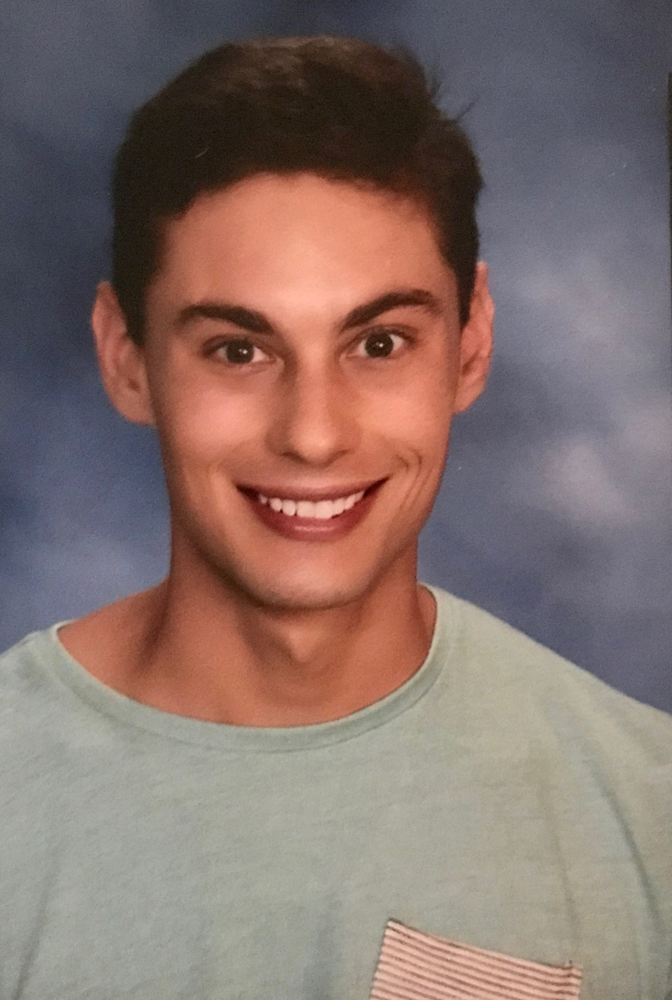
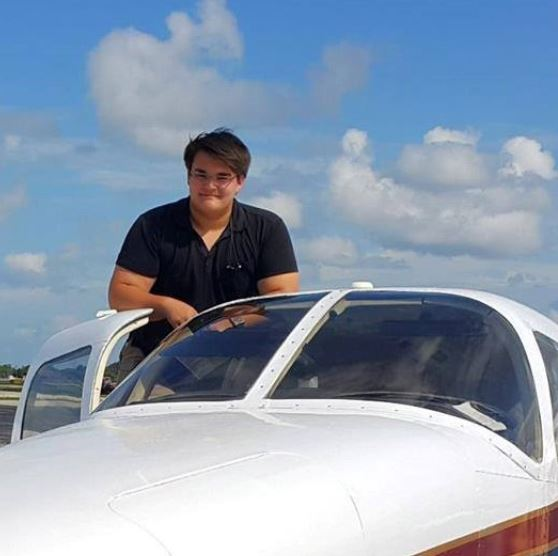

[Home Page](index.md)

# About Us

  

From left to right: Harrison, David, and Alex   

To learn more about our other professonial work, check us out on LinkedIn:

Harrison: [LinkedIn](https://www.linkedin.com/in/harrisonmintz/)

Alex: [LinkedIn](https://www.linkedin.com/in/alexander-scott-87a276107/)

David: [LinkedIn](https://www.linkedin.com/in/david-tarazi-335437169/)   

We are more than just professionals though! Read on to learn more about what we do when we're not building mind-blowing Python programs.

David: Just beginning his college path, David loves to go hiking and climb trees. In his freetime, you could find David playing basketball and listening to his favorite music artist, Lil Uzi Vert. David would like to apply his knowledge in the robotics industry and work with automation. 

Alex: An aviation enthusiast, Alex competed in Design, Build, Fly, a competition where students build airplanes to meet certain design parameters. As a soon-to-be college graduate, Alex is looking forward to entering the real world and becoming "the next Orville Wright with a splash of Amelia Earhart."

Harrison: A kombucha and coffee fiend, Harrison likes to spend his time walking along the ocean, drinking, and then frantically searching for bathrooms.  This summer he is heading off to LA to work as a marketing analyst at System1.
