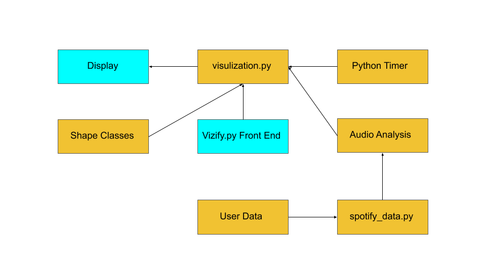
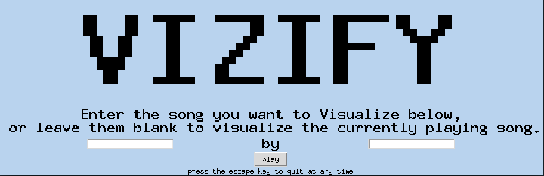

[Home Page](index.md)

Below is the project's UML Diagram.  This diagram provides a high level architectual overview of our code.

When the program is first run, it utilizes tkinter to create an interactive GUI displayed below that enables the user to input songs. The play button is linked to an exectution function that runs the visualization. The visualization function collects Spotify data for the song, then plays the song through the user's Spotify account as it starts the visualization. When the visualization starts, it will choose a style at random and then create a bunch of instances of a shape class which has functions that are updated every frame. The visualization runs at roughly 120 fps and the shapes' positions are updated on every frame. The visualization class also has a timer with beat stamps from the Spotify data that was collected. As soon as the timer passes the beat stamp, it will iterate through the currently shown shapes and update the way they are moving to synchronize motion change with the song.

The data that we are using from Spotify controls the visualization with a little bit of randomness added to it. First of all, we collect data such as the beat stamps which are the exact milliseconds that the beat occurs in the song. Furthermore, we collect some Spotify-generated data such as danceability and mood which control different aspects of the shapes and the color scheme. Finally, we use Spotify's API to see which song is currently playing and their search algorithm to find the song the user is looking for a playing it. We also needed to include an if-else statement to check whether a track as opposed to an ad was actually playing.  If an ad was playing on Spotify then our program would not attempt to pull data from Spotify (as this would result in an error).  This part of the code can be found in spotify_data.py.On a different note, for more information on how you can setup your credentials to work with Spotify's API please check out our [getting started](starting.md) page.  

The shapes utilized are rectangles and circles. For Rectangles, their width and heights are determined by the energy of the song being played.  High energy songs lead to the creation of bigger shapes and vice versa with low energy songs.  Similarly, the speed at which a Rectangle moves is determined by how danceable a song is deemed by Spotify.  The more danceable a song the faster it moves.  Circle's sizes (i.e. their radii) are determined by bow danceable the song playing is as is their movement speed.  The rate at which a Circle expands is determined by how loud a song is (the louder a song the faster the circle expands).

There are a few different methods within the shape classes. All of the speeds and sizes are initialized in the __init__ function. Both shape classes also have an update function which is called every frame during the visualization. This function listens to whatever type of style is currently being used and decides how to update their position and speed based on that style. This funtion creates a proxy of motion that is shown in the visualization. Furthermore, both classes utilize a function that moves the shape to a random position on the screen. Finally, they have a draw function that utilizes pygame to display the objects on the screen. 

While the shape classes are created in the file: "shape_classes.py," their instantiation is within the "visualization.py" script which creates a list of shapes and updates their motion on every beat or every few beats. The pygame display is updated every frame, but the way the shapes move is only updated on every beat or some factor of beats. Finally, there is a counter that waits every eight bars, then clears the list of shapes, creates a transition, then creates a new style which changes the way that the shapes are updating on every frame and how their motion changes every beat. This loop will continue until the ellapsed time passes the duration of the song. When this happens, the visualization window will close and the user can input a new song to create a visual for.

Note that this program utilizes Pygame extensively. For more information regarding how Pygame works click [HERE](https://www.pygame.org/docs/)

Furthermore, for information on how the program is collecting data, visit the Spotipy documentation linked [HERE](https://spotipy.readthedocs.io/en/latest/)

Click [HERE](index.md) to return to the home page.
