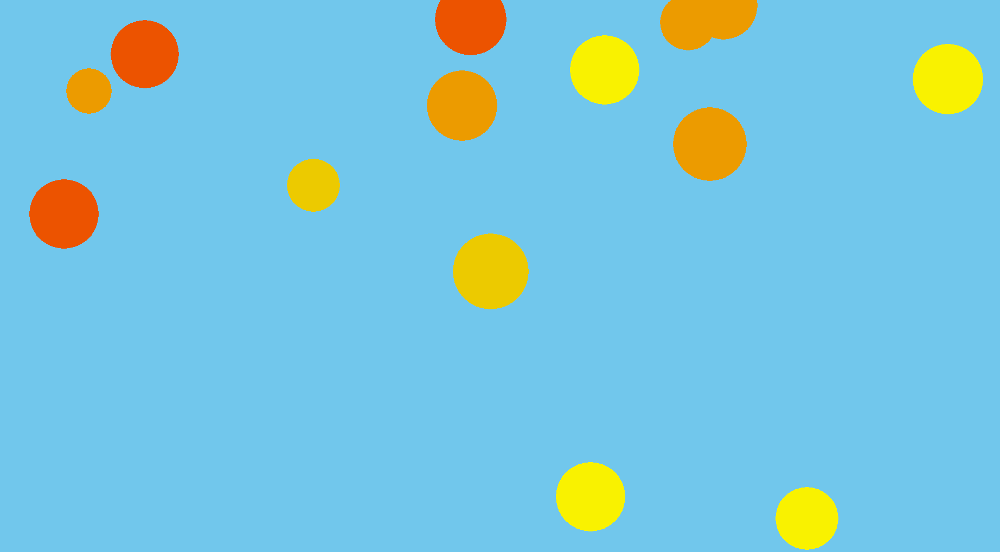

### Click on the image below check out our demo video!

### Project Description

The purpose of this program is to create engaging visualizations that play alongside a user's Spotify music. These visualizations utilize different quantitative descriptions of a song, such as its tempo, intensity, and danceability,to ensure the vibe of the visualization matches the vibe of the song. There are a few styles of visualization that are randomly selected throughout the duration of the song. Every eight bars the visual with transition to the next style. When the user first runs the program, they can use our interactive interface to search for songs to play on Spotify and create a visual for or simply press play and the algorithm will create a visual for whatever song the user is currently listening to. The goal of this program is to create a fun display that can go on in the background for the user to enhance their music experience.

### To learn more about the implementation of our code click [HERE](implementation.md)

If you're thinking "wow this is awesome but song should I listen to with it?" Well worry naught! Click [HERE](song_recs.md) for a list of our recommended songs to create cool visuals with.

By David Tarazi, Alex Scott, and Harrison Mintz

### To see how we got to this product, click [HERE](story.md)

### To learn about using our program, click [HERE](starting.md)

### To learn more about the three of us, click [HERE](about_us.md)
